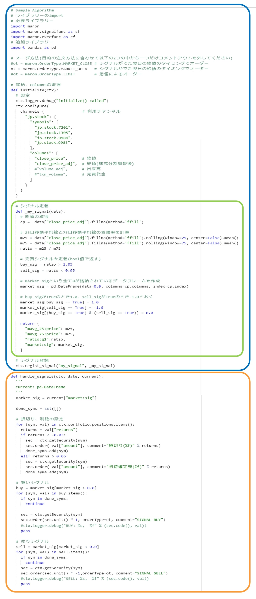

# サンプルコードを利用したチュートリアル

## 全体の構成 {#overview}

QuantXのpython coding におけるサンプルプログラムを例にしてアルゴリズム開発方法を説明します。
サンプルプログラムは、大きく分けると図のように青の部分とオレンジ色の2つの部分で関数されているのが分かります。



双方の関数とも、バックテストエンジンから必要なときに呼び出されます。

青の部分は最初に1度だけ呼び出される初期化部分です。

オレンジ色は取引の具体的なアクションについて記述された部分です。

そして、青の中に緑の部分があります。ここがsellかbuyのシグナルを生成する箇所になります。

ですので、一般にアルゴリズムを開発してバックテストを走らせる際は次のような動作をする事になります。

1. 青の部分が解釈され始めます。銘柄や使うデータ要素が指定されます。  

1. 緑の部分が解釈されます。ここでは全指定銘柄の全て過去のデータが入った配列全体に対して演算を行い、一定条件に入ったものに対してSellやbuyの値を入れていきます。（シグナルはすべてここで決まります）  

1. オレンジ色の部分が指定された日付の古い順に全ての日数分呼び出され解釈されます。  
指定日時のポジションを見ながら評価を行い、損切りや利益確定を行ったり、緑の所で指定されたシグナルに合わせて株の売り買いを行います。

<br style="clear: right">

## コード内容の解説{#code-top}

### 初期化部分{#initialize}

```python
def initialize(ctx):
```

初期化を行う関数。ctxのメソッドは、initialize()の中でのみ呼び出しが可能です。

```python
  ctx.configure()
```

この段落で、アルゴリズムで利用するデータの宣言を行うことで初期化を行います。

```python
    channels={               # 利用チャンネル
      "jp.stock": {
```

アルゴリズムで利用する日本株データを宣言しています。

```python
        "symbols": [
          "jp.stock.7201",
          "jp.stock.1305",
          "jp.stock.9984",
          "jp.stock.9983",
        ],
```

対象とする証券コードを指定します。たとえば、jp.stock.7201 は日産自動車株式会社を意味します。

```python
        "columns": [
          "close_price",     # 終値
          "close_price_adj", # 終値(株式分割調整後)
          "volume_adj",      # 出来高
          "txn_volume",      # 売買代金
        ]
```

シグナルを計算するために必要なデータ種を指定します。
現在使えるデータの種類は [データセット](dataset.jp.stock.md)を参照ください。

### 売買シグナル生成部分{#signal-emitter}

```python
　 def _my_signal(data):
```

売買シグナルを生成する関数の定義です。
ここで定義した関数を `ctx.regist_signal` で `ctx` に登録することでエンジンから使用されます。

ここでは全銘柄、指定期間の全日付、全データの入った3次元の配列である「data」そのものを配列のまま演算しています。
dataは、pandas.Panel オブジェクトで、

  * axis-0(items): データ項目(close_price, volume, etc.)
  * axis-1(major): 日付(datetime.datetime型)
  * axis-2(minor): 銘柄名(symbol object型)

と、定義されています。（注：dataへの変更は反映されませんので読み取り専用で使用してください。)

この例で行くとdataには、

2017/5/9の

|| close_price_adj | volume_adj | txn_volume |
|:-----------:|:------------:|:------------:|:------------:|
|jp.stock.7201|値|値|値|
|jp.stock.9201|値|値|値|
|jp.stock.9202|値|値|値|
|jp.stock.7203|値|値|値|

2017/5/10の

|| close_price_adj | volume_adj | txn_volume |
|:-----------:|:------------:|:------------:|:------------:|
|jp.stock.7201|値|値|値|
|jp.stock.9201|値|値|値|
|jp.stock.9202|値|値|値|
|jp.stock.7203|値|値|値|

　　　　　　　　　　　　　　　　　　：
　　　　　　　　　　　　　　　　　　：

　　　　　　　　　　　以下適用範囲内の日付全て

というようなイメージで、3次元的な形式で格納されています。

```python
　   cp =  data["close_price_adj"].fillna(method='ffill')
```

今回は計算には使用していませんが、仮にcpという変数で終値を定義したい場合、このように書きます。

```python
　   m25 = data["close_price_adj"].fillna(method='ffill').rolling(window=25, center=False).mean()
```

ここでは、データのうち「close_price_adj（株式分割調整後終値）」の25日移動平均を計算しています。
1行で記述していますが、式を分割して說明します。

まず、

```python
data["close_price_adj"]
```

ですが、3次元構造から、itemを指定することで2次元のpandas.DataFrameを取得しています。
取得されるデータは、次のようなイメージで、全銘柄、全日付のclose_price_adjが入った行列が返されます。

|| jp.stock.7201 | jp.stock.9201 | jp.stock.9202 | jp.stock.7203|…|
|:-----------:|:------------:|:------------:|:------------:|:------------:|:------------:|
|2017/5/1|終値|終値|終値|終値|…|
|2017/5/1|終値|終値|終値|終値|…|
|2017/5/2|終値|終値|終値|終値|…|
|2017/5/3|終値|終値|終値|終値|…|

```python
fillna(method='ffill')
```

こちらは、欠損データの補完を行っています。
データにはたまに欠損があります。これは例えばストップ安で値がつかなかったりするなど、様々な要因で終値がNaNとなることがあります。
NaNが計算式に含まれると、式の結果は自動的にNaNとなってしまうため、移動平均の計算に支障が発生する可能性があります。

そこで、このメソッドを使うとNaNがあった場合に、さまざまな方法で自動的に補完をしてくれるようになります。
また、β版ではデータの完全さは保証されておりませんのでその点ご了承ください。

```python
rolling(window=25, center=False).mean()
```

ここでは25個の値を連続して取得し、さらにその平均を取るというpandas.Dataframeのメソッドを呼び出しています。

rolling()についてはこちらを
[pandas.DataFrame.rolling ](http://pandas.pydata.org/pandas-docs/stable/generated/pandas.DataFrame.rolling.html)

mean()についてはこちらを参照ください。
[pandas.DataFrame.mean](http://pandas.pydata.org/pandas-docs/stable/generated/pandas.DataFrame.mean.html#pandas.DataFrame.mean)

最終的にm25という2次元配列に次のように終値の25日移動平均値が各銘柄、各日付において格納される結果となります。

|| jp.stock.7201 | jp.stock.9201 | jp.stock.9202 | jp.stock.7203|…|
|:-----------:|:------------:|:------------:|:------------:|:------------:|:------------:|
|2017/5/1|25日移動平均値|25日移動平均値|25日移動平均値|25日移動平均値|…|
|2017/5/2|25日移動平均値|25日移動平均値|25日移動平均値|25日移動平均値|…|
|2017/5/3|25日移動平均値|25日移動平均値|25日移動平均値|25日移動平均値|…|

```python
　   m75 = data["close_price_adj"].fillna(method='ffill').rolling(window=75, center=False).mean()
```

同様に終値の75日移動平均値の配列をm75に格納します。

```python
　   ratio = m25 / m75
```

2次元配列であるm25を、同様のサイズの2次元配列であるm75で割ります。
結果は25日移動平均値を75日移動平均値で割った値の2次元配列がratioに格納されます。

```python
　   buy_sig = ratio > 1.05
```

ここではまず、ratio > 1.05　が評価されます。つまり25日移動平均値を75日移動平均値で割った値が1.05を超えていた場合True、そうでない場合Falseの
真偽値の2次元配列が出来上がります。

|            | jp.stock.1305 | jp.stock.7201 | jp.stock.9983 | jp.stock.9984 |
|------------|---------------|---------------|---------------|---------------|
| 2019-05-08 | False         | False         | True          | True          |
| 2019-05-09 | False         | False         | True          | True          |
| 2019-05-09 | False         | False         | True          | True          |

```python
　   sell_sig = ratio < 0.95
```

同様に25日移動平均値を75日移動平均値で割った値が0.95より小さい場合True、そうでない場合Falseの
真偽値をsell_sig配列に格納します。

このままだと、buy_sigとsell_sigが二つ同時に起こる可能性があるので、その対策をしていきます。
ここでは、market_sigという市況シグナルを定義し、買いシグナルは1.0、売りシグナルは-1.0、取引しない状態を0で出すようにしていきます。
また、buy_sigとsell_sigが二つ同時に起こった場合、取引しないようにしていきます。

```python
　   market_sig = pd.DataFrame(data=0.0, columns=cp.columns, index=cp.index)
```

cpのDataFrameと同じindexおよびcolumnsのDataFrameを作成します。
最初は全て0の値を格納しています。

|            | jp.stock.1305 | jp.stock.7201 | jp.stock.9983 | jp.stock.9984 |
|------------|---------------|---------------|---------------|---------------|
| 2019-04-11 | 0             | 0             | 0             | 0             |
| 2019-04-12 | 0             | 0             | 0             | 0             |
| 2019-04-15 | 0             | 0             | 0             | 0             |

```python
　   market_sig[buy_sig == True] = 1.0
```

先程、定義したbuy_sigがTrueの時、market_sigの0の値を1.0に変えます。

|            | jp.stock.1305 | jp.stock.7201 | jp.stock.9983 | jp.stock.9984 |
|------------|---------------|---------------|---------------|---------------|
| 2019-04-11 | 0.0           | 0.0           | 1.0           | 1.0           |
| 2019-04-12 | 0.0           | 0.0           | 1.0           | 1.0           |
| 2019-04-15 | 0.0           | 0.0           | 1.0           | 1.0           |

```python
　   market_sig[sell_sig == True] = -1.0
```

同様に、定義したsell_sigがTrueの時、market_sigの0の値を-1.0に変えます。

```python
　   market_sig[(buy_sig == True) & (sell_sig == True)] = 0.0
```

最後に、buy_sigおよびsell_sigがTrueの時market_sigの値を0.0に変えます。

```python
　   return {
　     "mavg_25:price": m25,
　     "mavg_75:price": m75,
　     "ratio:g2":ratio,
　     "market:sig": market_sig,
　   }
```

後ほど利用する配列を定義して残します。
また、チャートで表示する際の項目名も定義します。
例えば「buy_sig」という配列を"buy:sig"という名前でチャートの下に表示させます。

なお、suffixとして、sigが使用された場合には、特別扱いされ、
チャート上で矩形がfillされて範囲の確認が可能になります。 このとき、

* keyにbuy,pos が含まれる場合には、ピンク
* keyにsell,neg が含まれる場合には、水色

の色が固定的に利用されます。

<span style="color:red">※QuantX Storeで販売したいアルゴリズムについては、必ず `market:sig` (市況シグナル)を return するようにしてください。</span>

```python
　 ctx.regist_signal("my_signal", _my_signal)
```

今まで解説してきた関数「my_signal」を登録して使うことを明示します。

### 日ごとの処理部分の記述{#handle-signals}

続いて、日ごとに呼び出される関数の説明です。これは例えば100日分のデータのバックテストをやる場合、100回呼び出される事になります。
ここで株をどの位売買するかの決定や損切り、利益確定売りを指定します。
この関数はエンジンから直接呼び出されます。

```python
def handle_signals(ctx, date, current):
```

dateはdatetime.datetime型 currentは、dateの当日のデータとシグナルを含んだ pandas.DataFrame オブジェクトで、以下のような構造になります。

|| close_price | open_price | sig1 |sig2(regist_signalで登録したシグナル)|
|:-----------:|:------------:|:------------:|:------------:|:------------:|
|jp.stock.7201|値|値|値|値|
|jp.stock.9201|値|値|値|値|
|jp.stock.9202|値|値|値|値|
|jp.stock.7203|値|値|値|値|

たとえば、current["close_price"] とすると、configure()で指定した銘柄のclose_priceのpandas.Seriesオブジェクトを返します。

ctxは以下のメソッドやプロパティを持つオブジェクトで,initialize()で渡されるctxとは別のオブジェクトとなります。

<dl>
  <dt>ctx.getSecurity(sym)</dt>
  <dd>symに相当する<a href="api.html#Security">Security</a>オブジェクト（銘柄情報)を返す</dd>

  <dt>ctx.portfolio</dt>
  <dd>ポートフォリオを管理する<a href="api.html#Portfolio">Portfolio</a>オブジェクト</dd>

  <dt>ctx.localStorage</dt>
  <dd>次回handle_signals()が呼び出された時に保存しておきたいデータを保存しておく領域。
ここに設定した値は、次回以降も設定されたままでhandle_signals()が呼び出されることが保証されます。</dd>
</dl>

```python
　 market_sig = current["market:sig"]
```

はじめに売買シグナルを定義するための判断材料となる市況シグナルを用意します。

```python
　 done_syms = set([])
```

当該の日にシグナルによる売買と「損切り、利益確定売り」が被らないようにフラグを用意します。

```python
　 for (sym, val) in ctx.portfolio.positions.items():
```

当該の日にポジションを持っている銘柄があった場合、そこの部分の処理をします。

```python
　   returns = val["returns"]
```

ポジションの時価との差異を取ります。

```python
　   if returns < -0.03:
```

時価が取得時より3%下落下かどうかを評価します。

```python
　     sec = ctx.getSecurity(sym)
```

当該銘柄のSecurityオブジェクトを取得。

なお、Securityオブジェクトには次のメソッドが有ります。

*    code()    : code値を返す(ex. 9984)
*    unit()    : 売買単位を返す(ex. 100)

```python
　     sec.order(-val["amount"],orderType=maron.OrderType.MARKET_OPEN, comment="損切り(%f)" % returns)
　     done_syms.add(sym)
```

売却処理を行い、当該の日ではシグナルでの売買をしないようフラグを立てます。

```python
　   elif returns > 0.05:
　     sec = ctx.getSecurity(sym)
　     sec.order(-val["amount"],orderType=maron.OrderType.MARKET_OPEN, comment="利益確定売(%f)" % returns)
　     done_syms.add(sym)
```

同様に5%以上値上がりしていたら利益確定売りをしてフラグを立てます。

```python
buy = market_sig[market_sig　> 0.0]
```

buyシグナルの項目のpandas.Seriesオブジェクトを取得します。ここでは市況シグナルが0より大きいものをbuyとして扱います。

```python
　 for (sym, val) in buy.items():
　   if sym in done_syms:
　     continue
```

buyシグナルが設定された所を実行します。ただし、損切りか利益確定売りをしたフラグが立っていたら無視します。

```python
　   sec = ctx.getSecurity(sym)
　   sec.order(sec.unit() * 1, orderType=ot, limit_price=current["close_price"][sym], comment="SIGNAL BUY")
　   pass
```

当該の銘柄の発注を行います。

株の数量指定は以下のURLを参照にしてください
https://factory.quantx.io/handbook/ja/api.html#Security

今回は買いシグナルが出たら、100株買うようにしています。

注文方法（orderType）は
1: 翌日の前場寄成
2: 翌日の後場引成
3: 指値

三つから指定でき、最初にimportしたmaronライブラリーのメソッドを使えば指定できます。

```python
#ot = maron.OrderType.MARKET_CLOSE # シグナルがでた翌日の終値のタイミングでオーダー
ot = maron.OrderType.MARKET_OPEN   # シグナルがでた翌日の始値のタイミングでオーダー
#ot = maron.OrderType.LIMIT        # 指値によるオーダー
```

今回は翌日の前場寄成による注文をしています。

また、注文した際のcommentも指定することができます。

```python
　 sell = market_sig[market_sig<0.0]
　 for (sym,val) in sell.items():
　   if sym in done_syms:
　     continue
　   sec = ctx.getSecurity(sym)
　   sec.order(sec.unit() * -1,orderType=ot, limit_price=current["close_price"][sym], comment="SIGNAL SELL")
　   #ctx.logger.debug("SELL: %s,  %f" % (sec.code(), val))
　   pass
```

同様に売り注文も実行します。

以上、サンプルプログラムの解説でした。
